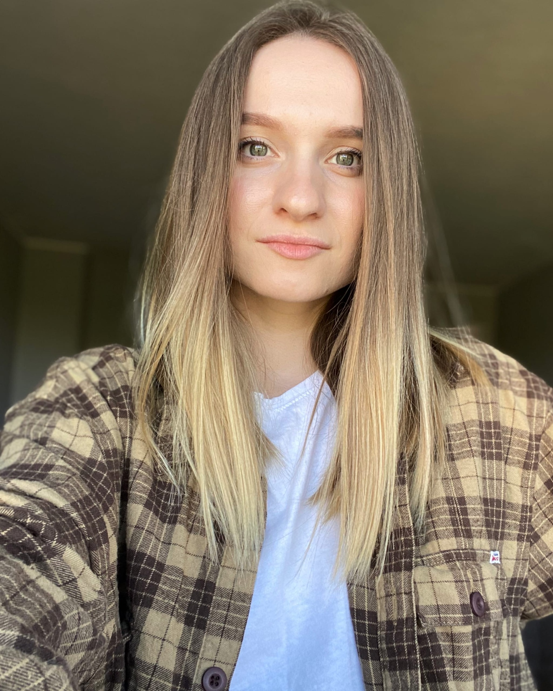

### rsschool-cv

## **Angelika Novikova** 

## QA Engineer

**Contact information:**

**Phone:** +37529 310 94 33

**E-mail:** anzhelika.novikova93@gmail.com

[LinkedIn](https://www.linkedin.com/in/angelika-novikova-13b3ab1b3/)

## Hard Skills:

- analysis of software requirements and project documentation;
- creating check lists, test cases, bug reports and test result reports;
- a good knowledge of Quality Assurance methodologies, software development and testing lifecycle;
- an experience in manual testing of web applications;
- basic knowledge of SQL;
-JIRA and Confluence, You Track, Qase;
- Terminal ( basic commands ) - cd, pwd, mkdir, rm, mv, vim; - Git,Git Bash;
- Postman, API testing

## Work Experience:

InnoTech Solutions LLC - QA Engineer ( december 2021 - july 2022 )

- Quality control of developed products;
- Identification and analysis of errors and problems that contribute to users when working with software products;
- Development of test scripts; 
- Documenting found defects.

## Education:
- Belarusian State Pedagogical University named after Maxim Tank
Faculty of Russian and Belarusian Philology ( 2011 - 2015 )

- IT Academy Stormnet " QA Engineer " ( 2020 )

## Languages:
- Italian - Intermediate 

- English - Basic

- Russian - Native